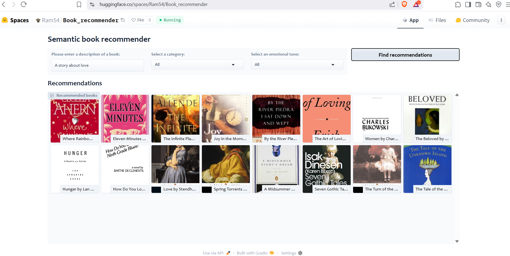

# 📚 Semantic Book Recommender with OpenAI + LangChain + Gradio

This project is an intelligent **Book Recommendation System** that leverages **Semantic Search**, **Large Language Models (LLMs)**, and **emotion-based filtering** to suggest books that match the intent and tone of your input, not just keywords. Powered by **OpenAI**, **LangChain**, and hosted on **Hugging Face Spaces** with an interactive **Gradio UI**.

---

## 🔍 Key Features

- 🔎 **Semantic Search**: Finds books based on the meaning of your input using OpenAI embeddings
- 🎭 **Emotion-Aware Filtering**: Choose tones like *Happy*, *Sad*, *Suspenseful*, etc.
- 📖 **Category-Based Filtering**: Refine by genre or theme
- 🧠 **LLM-Enhanced Retrieval**: Uses LangChain to manage document embeddings
- ⚡ **Gradio Interface**: Fast and intuitive web-based user interface
- 🌐 **Hosted on Hugging Face Spaces**

---

## 💡 Example Use Cases

- “Books about overcoming failure with a hopeful ending”
- “Something dystopian with a strong female lead”
- “Books that make you cry but also inspire”

---

## 🖼 Interface Preview

> 

---

## ⚙️ How It Works

1. **Book Metadata & Descriptions** are loaded from a dataset
2. **Descriptions** are embedded using `OpenAIEmbeddings` (via LangChain)
3. A **Chroma vector store** is created for semantic similarity search
4. The user enters a **natural language query**
5. Relevant book descriptions are matched semantically
6. Optional **filters by category and emotion tone** are applied
7. **Gradio Gallery** displays recommended books with thumbnails and summaries

---

## 🛠 Tech Stack

| Layer         | Tools/Libraries                             |
|---------------|----------------------------------------------|
| Language      | Python 3                                     |
| LLM Embedding | OpenAI API (`text-embedding-ada-002`)        |
| Retrieval     | LangChain + Chroma + FAISS                   |
| UI Framework  | Gradio (`Blocks` and `Gallery`)              |
| Hosting       | Hugging Face Spaces                          |
| Data Handling | Pandas, NumPy                                |
| Environment   | Python-dotenv + Hugging Face Secrets         |

---

## 📝 Files in This Repository
- `app.py` – Main app entry (Gradio + LangChain)
- `requirements.txt` – Dependencies for Hugging Face
- `books_with_emotions.csv` – Dataset with book metadata
- `tagged_description.txt` – Description file for embedding
- `cover-not-found.jpg` – Placeholder for missing thumbnails
- `README.md` – You're reading it!

## 🚀 Live Demo
👉 **[Try the App on Hugging Face Spaces](https://huggingface.co/spaces/Ram54/Book_recommender)**

# 🙋‍️ Author

**Ram**  
💼 Passionate about NLP, recommendation systems, and building real-world AI solutions.  
🔗 [LinkedIn](https://www.linkedin.com/in/ramakrishnaaruva/) 

